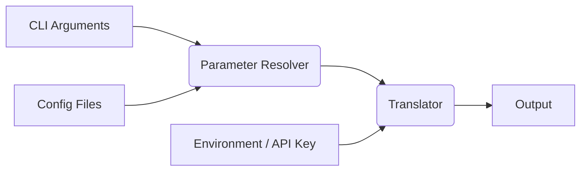

# Sagmal Architecture Overview

This document provides a comprehensive overview of the Sagmal CLI tool architecture, designed to help developers understand the codebase structure, data flow, and design principles.

## Module Architecture

### Data Flow

The application processes three independent input sources:

**Independent Input Sources:**
- **CLI Arguments**: Language options and text to translate
- **Config Files**: Home and local `.sagmalrc.json` files
- **Environment**: API key from environment variable, loaded from `.env` files

**Resolution Flow:**
1. Each input source is loaded independently and feeds into the Parameter Resolver.
2. Parameter resolver applies cascading priority: CLI → Local Config → Home Config → Defaults
3. Resolved parameters + API key feed into DeepL API translation

### Module Breakdown

#### `src/bin.ts` - Main Entry Point
- **Responsibility**: Application orchestration and final error handling
- **Data Flow**: Coordinates all input sources, handles final error display
- **Key Pattern**: Type-specific error handling (SagmalError vs DeepLError vs unknown)

#### `src/errors.ts` - Error Infrastructure
- **Responsibility**: Custom error types and error formatting utilities
- **Usage**: Provides `SagmalError` class and `stringifyError()` utility for consistent error handling

#### `src/env-loader.ts` - Environment Management
- **Responsibility**: Environment variable loading and API key retrieval
- **Data Source**: `.env` files
- **Key Behavior**: Validates API key presence

#### `src/config-loader.ts` - Configuration Management
- **Responsibility**: Loading and parsing config files
- **Data Source**: Home directory and current directory `.sagmalrc.json` files

#### `src/cli-parser.ts` - CLI Argument Parsing
- **Responsibility**: Parse all CLI arguments and return structured data
- **Output**: Parsed command options, language options, and remaining text parts
- **Key Pattern**: Uses Node.js built-in `parseArgs` and then also extract options from positionals

#### `src/cli-language-parser.ts` - CLI Language Option Parsing
- **Responsibility**: Parse individual colon-separated language options
- **Input**: Single CLI argument (`:en`, `ja:vi`, `de:`, etc.)
- **Output**: Language option data or null

#### `src/parameter-resolver.ts` - Central Parameter Resolution
- **Responsibility**: Single source of truth for all cascading logic
- **Input**: CLI arguments and text + config files + defaults (hardcoded)
- **Output**: Fully resolved parameters ready for DeepL API

#### `src/translator.ts` - DeepL API Integration
- **Responsibility**: Translation function
- **Input**: API key + text + resolved parameters
- **Output**: Translated text

#### `src/help.ts` - Help Display
- **Responsibility**: Display usage instructions
- **Trigger**: No arguments or explicit help flags

## Error Handling Principles

### Error Type Hierarchy

1. **`SagmalError`** - Application logic errors (validation)
   - **When to use**: Application-level issues not tightly coupled with DeepL API, validation failures
   - **Examples**: Missing API key, invalid config file

2. **`DeepLError`** - DeepL API errors
   - **When to use**: Automatically thrown by `deepl-node` library
   - **Examples**: Invalid API key, unsupported languages, service unavailable

3. **Generic `error: unknown`** - Unknown/system errors
   - **When to use**: Unexpected errors caught as fallback

### Error Display Formatting

- **Format**: Use `>` for representing error category/hierarchy
- **Single-line**: Simple errors
- **Multi-line**: Errors with underlying error context
- **Pattern**: Use `stringifyError()` utility when generic `error: unknown` is caught

## Validation Principles

### What We Validate (Application Logic)

1. **API Key Presence** - Required for operation
2. **Text Length** - Maximum 1024 characters to prevent accidental large data transmission
3. **Config File Structure** - Must be valid JSON objects
4. **Internal Field Protection** - Reject `__path` in DeepL options (reserved)
5. **Exception Wrapping** - Wrap predictable exceptions (e.g. `readFileSync()`)

### What We Don't Validate (User Responsibility)

- DeepL API options
- Language codes

### Validation Strategy

- **Approach**: Let DeepL API handle its own validation
- **Rationale**: DeepL API may change over time. It also provides appropriate errors.

## Key Architecture Decisions

1. **Centralized Parameter Resolution**: Single module handles all cascading logic to avoid scattered resolution
2. **Minimal API Validation**: Trust DeepL API for domain-specific validation (language codes, options)
3. **Independent Input Loading**: CLI, config, and environment sources load independently then merge
